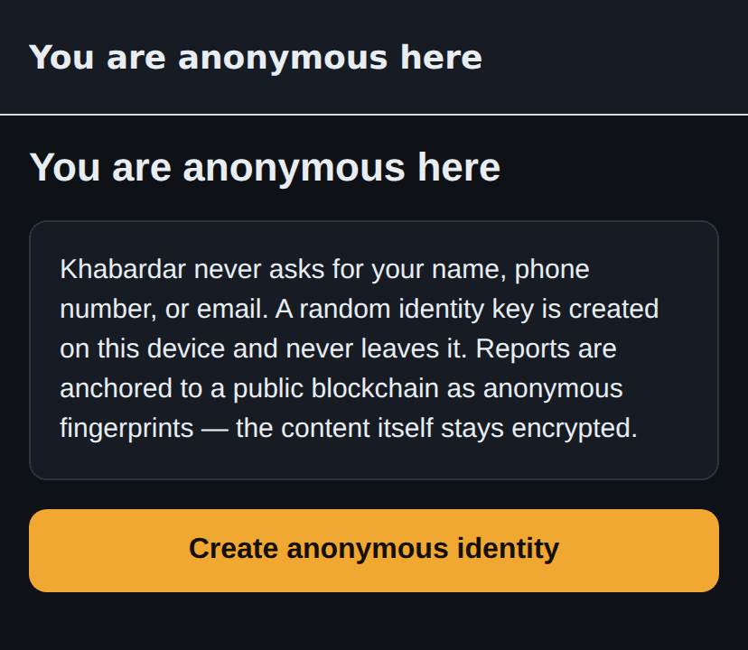
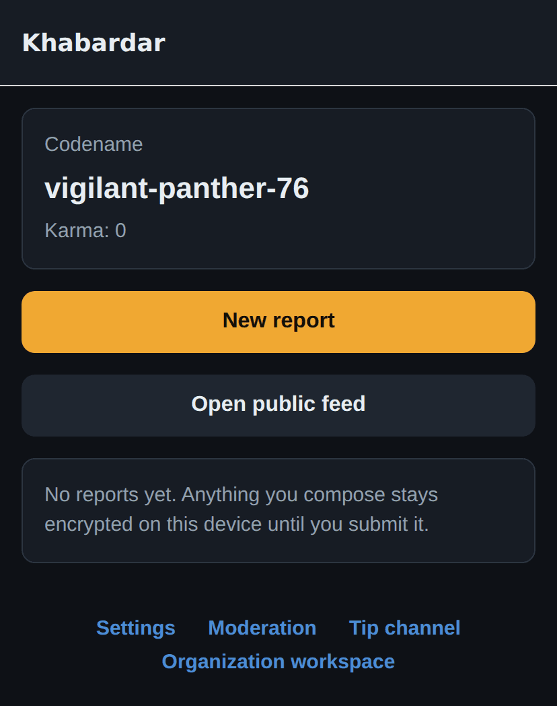
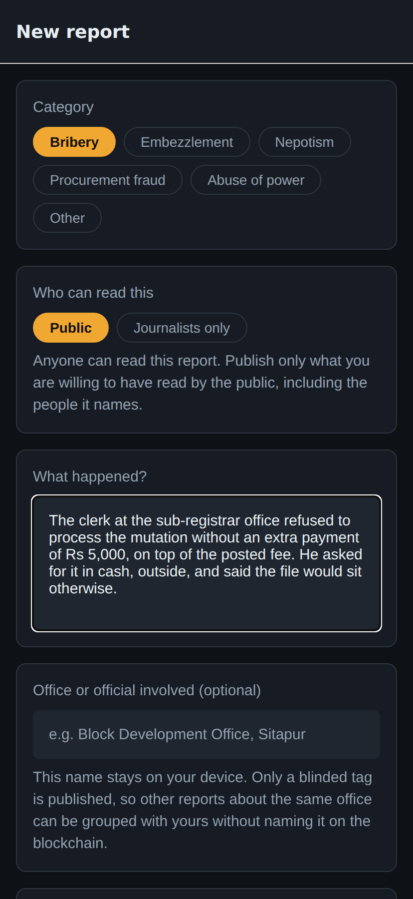
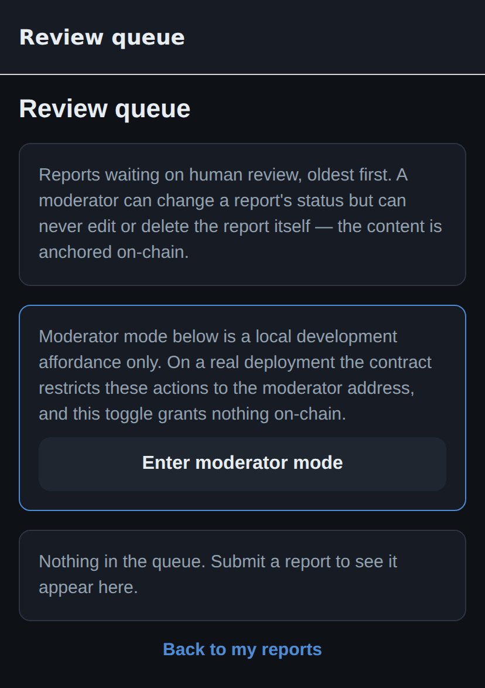
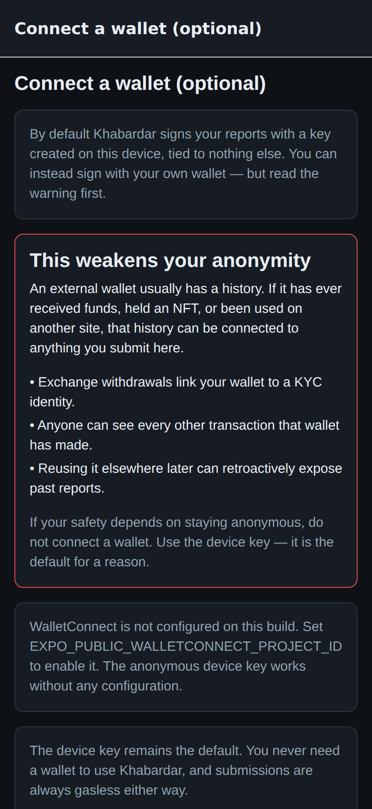

<div align="center">

# Khabardar &nbsp;·&nbsp; खबरदार

**Anonymous anti-corruption reporting, anchored on-chain.**

Compose a report, attach evidence, and anchor a tamper-proof fingerprint of it on the
Linea blockchain — without revealing who you are, without holding any cryptocurrency,
and without the app ever learning your name, phone number, or email.

[](https://github.com/sailenceresw/khabardar/actions/workflows/ci.yml)
[](./LICENSE)
[](./.nvmrc)
[](https://expo.dev)
[](https://linea.build)
[](#status)

[Quickstart](#quickstart) ·
[How it works](#how-it-works) ·
[Architecture](./docs/ARCHITECTURE.md) ·
[Roadmap](#roadmap) ·
[Security](./SECURITY.md) ·
[Contributing](./CONTRIBUTING.md)

</div>

---

> [!WARNING]
> **Do not use this for real reports yet.** Khabardar is a v0 prototype. It has not been
> audited, and it has no anonymising network transport — a targeted user could be
> deanonymized at the network layer no matter how good the cryptography is. If you are
> genuinely at risk, use [SecureDrop](https://securedrop.org) or
> [GlobaLeaks](https://www.globaleaks.org). See [SECURITY.md](./SECURITY.md).

## Screenshots

<div align="center">
<table>
<tr>
<td width="25%"></td>
<td width="25%"></td>
<td width="25%"></td>
<td width="25%"></td>
</tr>
<tr>
<td align="center"><sub><b>No signup</b><br>A device key is the whole identity</sub></td>
<td align="center"><sub><b>Codename, not address</b><br>Karma is earned, never bought</sub></td>
<td align="center"><sub><b>Compose</b><br>Entity name never leaves the device</sub></td>
<td align="center"><sub><b>Moderation</b><br>Tier can change; content cannot</sub></td>
</tr>
</table>



<sub>The optional wallet screen. The warning sits <b>above</b> the control, because the
honest answer to "can I use my own wallet?" is "yes, and it will weaken you."</sub>

</div>

## Status

Working end-to-end today: compose → encrypt → upload to the content layer → anchor hash
+ CID via a gasless transaction → read back in a public feed with an integrity check.
Also wired: entity clustering, a moderation review queue, an encrypted tip channel,
BIP-39 recovery, and an optional WalletConnect identity.

The relayer and content store default to local mocks, so **everything runs with no
credentials**.

| | |
|---|---|
| ✅ **Built and verified** | Anonymity core, chain layer (23 contract tests), content layer, public feed, moderation, tips, gasless abstraction, i18n (EN + HI) |
| 🟡 **Wired but unproven** | Real Pimlico submission, real IPFS pinning, evidence upload from compose, feed at scale |
| ❌ **Not started** | Anonymising transport, proof-of-personhood, C2PA provenance, stealth mode, billing backend, security audit |

Full honest breakdown in [BUSINESS.md](./BUSINESS.md). Open work is in
[Issues](https://github.com/sailenceresw/khabardar/issues) — the
[`blocker:mainnet`](https://github.com/sailenceresw/khabardar/issues?q=is%3Aissue+is%3Aopen+label%3Ablocker%3Amainnet)
label marks the hard gates.

## Quickstart

Requires Node 20 (see [`.nvmrc`](./.nvmrc)) and npm 10. No API keys, no wallet, no
testnet funds.

```bash
git clone https://github.com/sailenceresw/khabardar.git
cd khabardar
npm install

npm run contracts:test                        # 23 passing
npm run verify:slice --workspace apps/mobile  # headless end-to-end slice
npm run mobile:web                            # dev server with hot reload
```

Then walk the slice: create identity → **New report** → fill category/body/area →
**Review & submit** → watch it anchor (simulated tx via `MockRelayer`) → the status
screen shows the report fingerprint and tx hash.

<details>
<summary><b>Other ways to run it</b></summary>

```bash
npm run mobile:start                          # QR code for Expo Go on a device

# Static web build — no file watcher, always starts
npm run web:export --workspace apps/mobile
npm run web:static --workspace apps/mobile    # serves dist/ on :8085
```

**`verify:slice`** runs the real `cryptoUtils` / `encoding` / `evidence` / `content` /
`MockRelayer` modules under Node (with `expo-crypto`, AsyncStorage, SecureStore and the
image modules shimmed) and asserts the full path: encrypt → decrypt round-trip →
deterministic keccak256 fingerprint → blinded entity tag → evidence upload returning a
resolvable CID → ABI-encoded `submitReport()` calldata → device-key signature → relay
result. It is the fastest way to confirm the chain-facing logic still works, and is
CI-safe.

To go against the real testnet, copy `.env.example` → `.env` and follow
[gasless setup](./docs/ARCHITECTURE.md#gasless-flow-nobody-holds-eth).

</details>

<details>
<summary><b>Troubleshooting: Metro hangs on Windows</b></summary>

On Windows **without Watchman**, Metro falls back to a recursive `fs.watch` watcher that
intermittently never finishes starting, failing after a 240-second timeout with:

```
Failed to construct transformer: Error: Failed to start watch mode.
```

This is not a project misconfiguration — `watchFolders` is already minimal (only
`packages/shared`; resolution uses `resolver.nodeModulesPaths`, which is not watched).
Two fixes, either works:

1. **Install Watchman** (recommended, what React Native expects):
   `winget install facebook.watchman`, then restart your shell so it lands on `PATH`.
   `.watchmanconfig` files at each watch root are already committed.
2. **Skip the watcher entirely** with `web:export` + `web:static` above. No hot reload,
   but it always starts — this is the reliable path for verification and screenshots.

</details>

## How it works

Three layers, and the split between them is the whole design:

| Layer | Holds | Who can read it |
|---|---|---|
| **Device** | plaintext, only while composing | you |
| **Content store** (IPFS) | the **encrypted** bundle + evidence blobs | whoever holds the content key |
| **Chain** (Linea) | `reportHash` + `cid` + coarse metadata | everyone, forever |

Content never touches the chain — only a `keccak256` fingerprint and a pointer. Because
the fingerprint covers the *encrypted* bundle, any reader can recompute it and compare
against the chain, so a hostile gateway that swaps a bundle is **detected rather than
believed**.

```
device keypair ──owns──▶ counterfactual smart account
      │                             │
      │ signs userOpHash            │ sender of UserOperation
      ▼                             ▼
UserOperation{ callData: submitReport(hash, category, geohash) }
      │
      ├─▶ pm_sponsorUserOperation  (verifying paymaster — a sponsor pays the gas)
      └─▶ eth_sendUserOperation    (bundler → EntryPoint v0.7 on Linea)
```

Nobody holds ETH. A sponsor reimburses the paymaster, and the reporter never sees a
payment step.

### What protects the reporter

| Threat | Mitigation |
|---|---|
| Identity leakage at signup | No PII collected — device keypair only (`src/identity.ts`) |
| EXIF/GPS in evidence | Client-side re-encode before anything is stored (`src/evidence.ts`) |
| Precise location in report | Geohash hard-capped at 4 chars ≈ city level (`src/geo.ts`) |
| Device seizure | AES-256-GCM at rest + **panic delete** wipes drafts, evidence, keys, identity (`src/panic.ts`) |
| Content on a public chain | Only fingerprints go on-chain, never content |
| Network observation | **Not yet mitigated** — [#9](https://github.com/sailenceresw/khabardar/issues/9) is the biggest open gap |

Three design decisions that are easy to get wrong, and why they went this way:

- **No email or phone login, ever.** An auth provider is one subpoena away from
  deanonymizing every reporter. A BIP-39 phrase gives the same recovery benefit with
  nothing held by anyone but the user.
- **Entity names stay on the device.** Only a blinded `keccak256` tag is published, so
  reports about the same office cluster without naming it on-chain. This is reversible
  by dictionary attack, and that is an accepted trade-off — *the accused is not the
  secret, the reporter is.*
- **Sponsor attribution is aggregate only.** A per-report sponsor tag would shrink a
  report's anonymity set below what the reporter consented to, so `sponsorPoolId` is
  deliberately excluded from calldata.

→ Full detail in **[docs/ARCHITECTURE.md](./docs/ARCHITECTURE.md)**.

## Project structure

```
khabardar/
├── apps/
│   └── mobile/            # Expo (React Native) — iOS, Android, web preview
│       ├── app/           # expo-router screens (feed, compose, moderation, tips, …)
│       └── src/
│           ├── content/   # encrypted blob store (IPFS/mock) + ECIES key wrapping
│           ├── feed/      # network index, demo seed, fetch+decrypt+integrity check
│           ├── relayer/   # gasless submission (mock / Pimlico)
│           ├── wallet/    # optional WalletConnect v2
│           └── …          # identity, recovery, crypto, evidence, moderation, tips, i18n
├── packages/
│   ├── contracts/         # Hardhat + Solidity (ReportRegistry.sol) → Linea
│   └── shared/            # chain config, ABI, TypeScript types shared app↔contracts
├── docs/
│   └── ARCHITECTURE.md    # anonymity model, chain, content, gasless, moderation
├── BUSINESS.md            # revenue model, unit economics, honest build status
└── .env.example           # every env var documented
```

## Roadmap

Tracked as [issues](https://github.com/sailenceresw/khabardar/issues), grouped by phase:

| Phase | Focus |
|---|---|
| [`v0.1-testnet`](https://github.com/sailenceresw/khabardar/issues?q=is%3Aissue+is%3Aopen+label%3Av0.1-testnet) | Stop being a mock — deploy to Linea Sepolia, real sponsored gas, real IPFS, evidence upload wired, CI |
| [`v0.2-anonymity`](https://github.com/sailenceresw/khabardar/issues?q=is%3Aissue+is%3Aopen+label%3Av0.2-anonymity) | Tor transport, proof-of-personhood, tip padding and forward secrecy, verifiable recipient keys, stealth mode |
| [`v0.3-scale`](https://github.com/sailenceresw/khabardar/issues?q=is%3Aissue+is%3Aopen+label%3Av0.3-scale) | Real indexer, karma-weighted jury, publicly auditable moderation log, large/audio/document evidence |
| [`v1.0-launch`](https://github.com/sailenceresw/khabardar/issues?q=is%3Aissue+is%3Aopen+label%3Av1.0-launch) | Demo data removed, external audit, org billing backend, C2PA provenance, more languages |

**The three that matter most**, because without them nothing else is safe to use:

1. **[Anonymising transport](https://github.com/sailenceresw/khabardar/issues/9)** —
   the largest remaining gap. Every other protection is downstream of this one.
2. **[Proof-of-personhood](https://github.com/sailenceresw/khabardar/issues/10)** —
   corroboration and karma are only as sybil-resistant as the account set.
3. **[Independent audit](https://github.com/sailenceresw/khabardar/issues/22)** — the
   "do not use this yet" notice should only be removed by someone outside this project.

## Known limitations

Stated plainly, because a security tool that oversells itself is worse than one that
does not exist:

- **No anonymising transport.** Currently the weakest link in the entire design.
- `MockRelayer` fabricates tx hashes and `MockContentStore` writes locally — nothing is
  on-chain or on IPFS until real providers are configured.
- Corroboration is not sybil-resistant. Entity tags are reversible by dictionary attack.
- A single moderator address is a centralization point — testnet only.
- The moderation decision log is device-local, so moderators are not yet auditable.
- The web build's SecureStore fallback is localStorage — **dev preview only**.
- Demo recipient keys, sample feed rows, and demo sponsor pools ship in this build and
  must be removed before any real deployment.
- **No security audit has been performed.**

## Contributing

See [CONTRIBUTING.md](./CONTRIBUTING.md). The one rule: **a change must not make it
easier to identify a reporter.** Everything else is negotiable.

Good first issues are labelled
[`P2`](https://github.com/sailenceresw/khabardar/issues?q=is%3Aissue+is%3Aopen+label%3AP2);
the design questions worth arguing about are
[`type:research`](https://github.com/sailenceresw/khabardar/issues?q=is%3Aissue+is%3Aopen+label%3Atype%3Aresearch).

By participating you agree to the [Code of Conduct](./CODE_OF_CONDUCT.md).

## Licence

[AGPL-3.0](./LICENSE). Copyleft is deliberate: anyone who runs a modified Khabardar as a
service must publish their changes. For a tool whose users are trusting the code with
their safety, a silently modified fork is precisely the threat.

## Prior art

[SecureDrop](https://securedrop.org) and [GlobaLeaks](https://www.globaleaks.org) are the
reference implementations for anonymous whistleblowing, and this project borrows their
two central principles: the platform must not be able to deanonymize its users, and
metadata is as dangerous as content. They are audited and deployed; this is not. Use
them for anything real.
