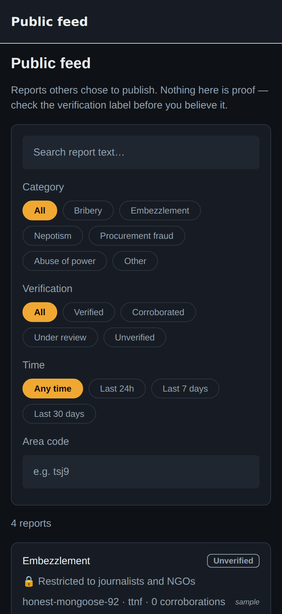
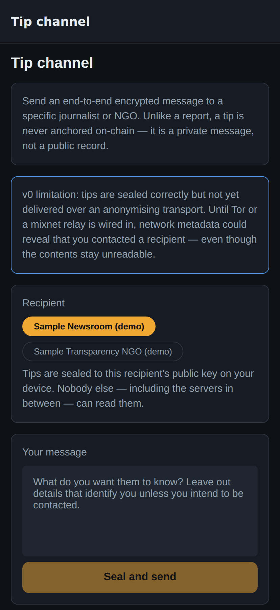
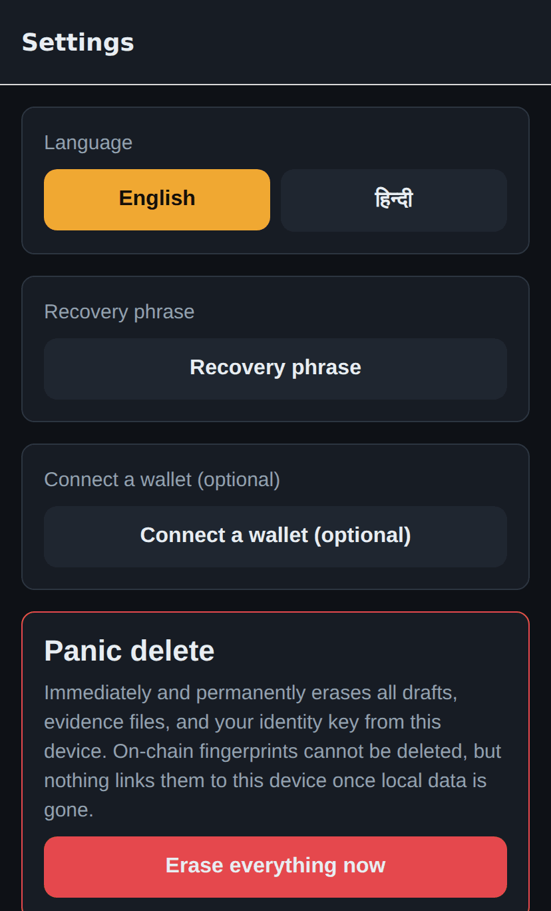

# Architecture

Deep detail on how Khabardar works. For the short version, see the
[README](../README.md). For revenue model and build status, see
[BUSINESS.md](../BUSINESS.md).

## Contents

- [Anonymity model](#anonymity-model)
- [Why React Native (Expo) and not Flutter](#why-react-native-expo-and-not-flutter)
- [Blockchain layer (Linea)](#blockchain-layer-linea)
- [Content layer](#content-layer--how-reports-become-readable)
- [Linking reports without deanonymizing anyone](#linking-reports-without-deanonymizing-anyone)
- [Identity: three options, one default](#identity-three-options-one-default)
- [Gasless flow](#gasless-flow-nobody-holds-eth)
- [Sponsored gas pools and attribution](#sponsored-gas-pools-and-attribution)
- [Organizations — the accountable side](#organizations--the-accountable-side)
- [Verification and moderation](#verification-and-moderation)
- [Tip channel](#tip-channel)
- [i18n](#i18n)

---

## Anonymity model

Prior art: [GlobaLeaks](https://www.globaleaks.org) and
[SecureDrop](https://securedrop.org), the reference implementations for anonymous
whistleblowing. The design borrows two principles from them:

- **The platform must not be able to deanonymize its users** (SecureDrop: no accounts,
  source codenames, Tor-only). Khabardar's analogue: no signup, a **device-bound
  secp256k1 keypair** generated locally in the secure enclave/Keystore is the entire
  identity. The UI shows a derived codename (e.g. `silent-heron-42`), never the address.
- **Metadata is as dangerous as content** (GlobaLeaks strips file metadata server-side;
  SecureDrop sanitizes documents). Khabardar strips **client-side, before anything is
  stored**: photos are re-encoded through expo-image-manipulator (EXIF/GPS/device tags
  do not survive re-encode), the picker is called with `exif: false`, and Android
  location permissions are **blocked in the manifest** so precise geolocation cannot
  even be requested.

Concrete guarantees in this scaffold:

| Threat | Mitigation |
|---|---|
| Identity leakage at signup | No PII collected — device keypair only (`src/identity.ts`) |
| EXIF/GPS in evidence | Re-encode pipeline (`src/evidence.ts`) |
| Precise location in report | Geohash hard-capped at 4 chars ≈ city level (`src/geo.ts`) |
| Device seizure | AES-256-GCM at rest + **panic delete** wipes drafts, evidence, keys, identity (`src/panic.ts`) |
| Content on a public chain | Only `keccak256` fingerprints go on-chain, never content |
| Network observation | **Not yet mitigated** — Tor/onion or mixnet transport is [#9](https://github.com/sailenceresw/khabardar/issues/9) |

## Why React Native (Expo) and not Flutter

Both are fine cross-platform frameworks; the deciding factor is the **blockchain layer**:

1. **The entire Ethereum/AA toolchain is TypeScript-first.** viem, permissionless.js,
   Pimlico/thirdweb/Biconomy SDKs — all TS. Dart bindings (web3dart) lag badly on
   ERC-4337/EIP-7702 support; we would end up hand-rolling UserOperation plumbing.
2. **One language across the monorepo.** The app imports the contract ABI and types
   directly from `@khabardar/shared`; contract changes surface as compile errors in the
   app.
3. **Expo's security-relevant modules** (SecureStore → Keychain/Keystore, expo-crypto,
   ImageManipulator for EXIF-free re-encode) cover our anonymity primitives out of the
   box, plus EAS OTA updates let us ship security fixes without store review delays.

## Blockchain layer (Linea)

- **Chains:** Linea Sepolia testnet (`59141`) now; Linea mainnet (`59144`) later.
- **Why Linea:** post-Pectra Linea supports **EIP-7702** natively and serves ERC-4337
  bundler methods on `rpc.linea.build`; the AA provider ecosystem (Pimlico, thirdweb,
  Etherspot, Biconomy, Arka) is first-class. Status Network — previously the "gasless
  L2" on the Linea stack — **merged into Linea (April 2026)**, so we build against
  Linea directly and borrow Status's ideas rather than their SDK:
  - **Karma:** non-transferable reputation (`ReportRegistry.karma`) — credibility that
    cannot be bought or transferred, only earned through verified reports.
  - **RLN-style rate limiting:** planned — sybil-resistant per-epoch submission limits
    to keep a gasless endpoint spam-free ([#10](https://github.com/sailenceresw/khabardar/issues/10)).

**`ReportRegistry.sol`** stores per report: `reportHash` (fingerprint of the encrypted
bundle), `cid` (pointer to that bundle in the content layer), category, visibility,
verification tier, coarse geohash, blinded `entityTag`, timestamp, and the pseudonymous
reporter address. A moderator role (v0: single address; later: karma-weighted jury)
sets the tier, adjusting reporter karma.

## Content layer — how reports become readable

The chain holds a hash and a pointer; the bytes live elsewhere. Without this, a report
is a diary entry nobody else can read.

| Layer | Holds |
|---|---|
| Device | plaintext, only while composing |
| Content store (IPFS/Arweave) | the **encrypted** bundle + evidence blobs |
| Chain | `reportHash` + `cid` + coarse metadata |

Each report gets a **fresh content key**. What happens to that key is the whole
visibility model:

- **Public** — the key is published in the bundle's keyring, so anyone can read it.
- **Journalists only** — the key is wrapped per recipient with **ECIES**
  (ephemeral secp256k1 ECDH → HKDF-SHA256 → AES-256-GCM). Only a listed private key
  opens it; everyone else sees the report as locked.

Because `reportHash` covers the *encrypted* bundle, any reader can recompute it and
compare against the chain. The feed does this on every fetch and shows
`⚠️ Content does NOT match the on-chain fingerprint` when it fails — so a hostile
gateway that swaps or edits a bundle is detected rather than believed. Malformed
responses degrade to "unavailable" instead of throwing, so a bad gateway cannot crash
the reader either.

`EXPO_PUBLIC_CONTENT_STORE` selects `mock` (default, local, no credentials) or `ipfs`.



The public feed is where that verification surfaces. It filters by category,
verification tier, time window, and area code, searches free text over readable bodies,
and marks restricted bundles as locked rather than hiding them. Sample rows are labelled
`sample` so a fictional report can never be mistaken for a real one — those rows must be
removed before deployment ([#21](https://github.com/sailenceresw/khabardar/issues/21)).

<br clear="right">


## Linking reports without deanonymizing anyone

Several people reporting the same office is the strongest signal the system has. Doing
that naively means publishing the accused entity's name on-chain.

Instead, the entity name **stays on the device** and only
`keccak256("khabardar/entity-tag/v1" | normalized(name))` is published. Identical
entities produce identical tags, so reports cluster (`reportsForEntity`), while the tag
itself carries nothing about who filed it. Normalization is aggressive, so
`"Block Development Office, Sitapur"` and `"block development office sitapur"` collide.

**Honest limit:** this is not hiding the entity from a determined observer — the set of
public offices is enumerable, so tags are reversible by dictionary attack. That is an
accepted trade-off: *the accused is not the secret, the reporter is.* What it does buy
is keeping entity names out of restricted reports entirely and out of casual chain
scraping.

Separately, `corroborate(reportId)` lets a witness back a report; the contract blocks
self-corroboration and double-voting, and auto-promotes to `CommunityCorroborated` at
3 independent corroborations. **This is only as sybil-resistant as the caller set** —
production must gate it behind proof-of-personhood
([#10](https://github.com/sailenceresw/khabardar/issues/10)).

## Identity: three options, one default

| Mode | How | Anonymity |
|---|---|---|
| **Device key** (default) | secp256k1 key generated on-device from a BIP-39 phrase | Strongest — tied to nothing else |
| **Recovery phrase** | Same key, restorable on a new device from 12 words | Same as above |
| **WalletConnect** (opt-in) | Sign with an external wallet | **Weaker** — see below |

There is deliberately **no email/phone login**. An auth provider is one subpoena away
from deanonymizing every reporter; a BIP-39 phrase gives the same "don't lose
everything with your phone" benefit with nothing held by anyone but the user.

**WalletConnect** is available for people who already manage keys, but it is never the
default and never required. The screen shows an unmissable warning *above* the connect
control, because a reused wallet carries a public history — exchange withdrawals tie it
to KYC, and reusing it later can retroactively expose past reports. Requires
`EXPO_PUBLIC_WALLETCONNECT_PROJECT_ID`; without it the screen says so and the device key
keeps working.

## Gasless flow (nobody holds ETH)

```
device keypair ──owns──▶ counterfactual smart account (SimpleAccount)
      │                             │
      │ signs userOpHash            │ sender of UserOperation
      ▼                             ▼
UserOperation{ callData: submitReport(hash, category, geohash) }
      │
      ├─▶ pm_sponsorUserOperation  (Pimlico verifying paymaster — sponsor pays)
      └─▶ eth_sendUserOperation    (Pimlico bundler → EntryPoint v0.7 on Linea)
```

The relayer is an interface (`src/relayer/`) with two implementations:

- **`MockRelayer` (default):** runs the identical encode → sign pipeline, then simulates
  the bundler locally. No network, no credentials. This is what the scaffold demo uses.
- **`PimlicoRelayer`:** real integration points against Pimlico's bundler/paymaster
  JSON-RPC on Linea Sepolia, env-gated. Written against raw `pm_sponsorUserOperation` /
  `eth_sendUserOperation` so the protocol surface is explicit; swap in permissionless.js
  to productionize.

**What a real gasless setup needs** (~15 min):

1. Create an API key at [dashboard.pimlico.io](https://dashboard.pimlico.io).
2. Add a **sponsorship policy** scoped to your deployed `ReportRegistry` address
   (so the paymaster only ever sponsors report submissions), and fund it.
3. Deploy the contract: `npm run contracts:deploy:sepolia` (needs
   `DEPLOYER_PRIVATE_KEY` + Sepolia ETH from the
   [Linea faucet](https://docs.linea.build/get-started/how-to/get-testnet-eth)).
4. Set in `.env`: `EXPO_PUBLIC_GASLESS_PROVIDER=pimlico`,
   `EXPO_PUBLIC_PIMLICO_API_KEY`, `EXPO_PUBLIC_REPORT_REGISTRY_ADDRESS`.
5. Finish the two marked TODOs in `pimlicoRelayer.ts` — counterfactual account
   derivation ([#3](https://github.com/sailenceresw/khabardar/issues/3)) and receipt
   polling ([#4](https://github.com/sailenceresw/khabardar/issues/4)) — or replace the
   class body with permissionless.js's `createSmartAccountClient`, which handles both.

Alternative providers (same interface, different config): thirdweb, Etherspot Prime,
Biconomy, or self-hosted [Arka](https://github.com/etherspot/arka) if operator
independence from a commercial paymaster is required — likely the right endgame for an
anti-corruption tool.

### Privacy note on sponsored gas

A paymaster sees the UserOperations it sponsors (sender address, calldata, IP of the
submitting client). Since calldata is only ever a hash + category + coarse geohash,
content stays private, but **network-level anonymity (Tor) is required before mainnet**
to prevent IP↔pseudonym linkage by relayer infrastructure.

## Sponsored gas pools and attribution

Organizations can fund submission gas for a region or category
(`packages/shared/src/sponsor.ts`, `apps/mobile/src/sponsorPools.ts`). Reporters never
see a payment step; the pool only decides who reimburses the paymaster.

**Attribution is aggregate only, by design.** A per-report sponsor tag would be a side
channel: a narrowly-scoped sponsor would shrink a report's anonymity set below what the
reporter consented to by publishing a coarse geohash. So `sponsorPoolId` travels as
paymaster accounting context and is deliberately *excluded from calldata*, sponsors
receive counts rather than per-report ledgers, and any pool below `MIN_SCOPE_REPORTS`
(50) goes unnamed in the UI even though it still pays.

## Organizations — the accountable side

`Organization` (`packages/shared/src/org.ts`, `apps/mobile/src/org.ts`) is a **named**
account for newsrooms, NGOs, oversight bodies, researchers, and funders. It is stored
under separate keys, with a separate lifecycle, from reporter identity, and the two are
never returned together — an org account is billable and contactable, a reporter account
is a device key and nothing else. Joining them would break the product's central
guarantee.

Accreditation is not self-serve: a new org gets Community entitlements regardless of
selected plan until a human verifies it, because analytics over a whistleblower corpus
should never be one signup form away. Plans and entitlements gate corpus export
(`apps/mobile/src/export.ts`), which excludes restricted reports and never exports
reporter addresses.

## Verification and moderation

Reports move through explicit tiers, and **nothing is presented as credible until it
has moved past `Unverified`**:

`Unverified → UnderReview → CommunityCorroborated → Verified` (or `Disputed`)

The review queue (`/moderation`) lists everything not yet adjudicated, oldest first,
with each report's integrity-check result. A moderator can change a report's **tier**
but can **never edit or delete the report** — the content is anchored on-chain, so
moderation adds judgement on top of an immutable record rather than rewriting it. Every
decision is logged with a reason.

Two things about this are deliberately unfinished and should not be glossed over:

- The in-app "moderator mode" toggle is a **local dev affordance**. The real gate is the
  contract's `onlyModerator` check; the toggle grants nothing on-chain.
- The decision log is **on-device only**. Production must publish decisions (or their
  hashes) so moderators are auditable by the same public being asked to trust them. A
  moderation system nobody can audit is just censorship with extra steps.
  ([#17](https://github.com/sailenceresw/khabardar/issues/17))

On detecting AI-generated reports: **do not ship a naive AI-text detector.** They have
high false-positive rates on second-language English writers, which describes a large
share of the intended users — it would systematically silence exactly the people this
exists for. The defensible stack is provenance (C2PA capture signatures), personhood
(RLN / anonymous credentials), and corroboration. AI belongs in triage, never as judge.

## Tip channel



`/tips` sends an end-to-end encrypted message to a named journalist or NGO. Unlike a
report, a tip is **never anchored on-chain** — it is a private message, not a public
record. Sealing uses the same ECIES construction as restricted bundles, so only the
recipient's private key opens it, and only a short preview + digest stay on the device.

Three gaps to close before anyone relies on it, all documented in `src/tips.ts`:

- **Transport.** Tips are sealed but not delivered over an anonymising transport yet.
  Network metadata is what deanonymizes people, not ciphertext.
  ([#9](https://github.com/sailenceresw/khabardar/issues/9))
- **Padding.** Message length currently leaks; tips should be padded to fixed buckets.
  ([#11](https://github.com/sailenceresw/khabardar/issues/11))
- **Forward secrecy.** A recipient key compromise retroactively opens past tips.
  ([#12](https://github.com/sailenceresw/khabardar/issues/12))

Recipient keys in `src/content/recipients.ts` are **demo placeholders**. Production must
publish them somewhere independently verifiable (DNS TXT, a well-known URI on the
organisation's own domain, or an on-chain registry) and pin them in-app, so a compromised
backend cannot silently swap in its own key and read every restricted report.
([#13](https://github.com/sailenceresw/khabardar/issues/13))

## i18n



English + Hindi (`apps/mobile/src/i18n/`). Locale auto-detects from the device and can
be switched in Settings. All UI strings go through `t()` — add a language by dropping a
new JSON file.

Language coverage is not cosmetic here. The people best placed to report corruption are
often not comfortable in English, and a tool that only speaks English selects for the
wrong reporters. Expanding beyond Hindi and English, and adding voice-first input, is
[#26](https://github.com/sailenceresw/khabardar/issues/26) — with the hard constraint
that speech recognition must run **on-device**, since a cloud speech API would receive
the reporter's voice and IP address together.

<br clear="right">
